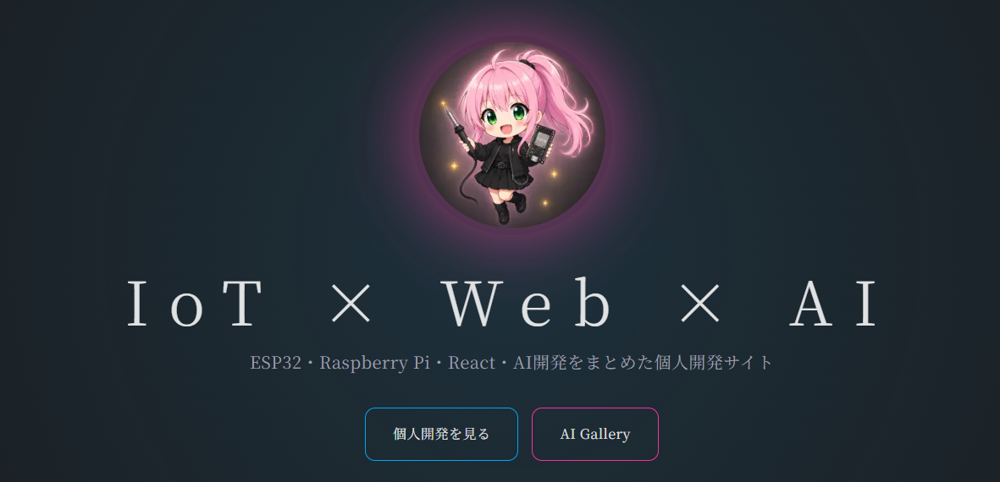

# nnzzm Portfolio

**IoT × Web × AI Developer Portfolio**

ESP32・Raspberry Pi・Next.jsを中心に、IoT・Web・AIを組み合わせた個人開発の成果をまとめているポートフォリオサイトです。

🌐 **Website:** https://www.nnzzm.com  
💻 **GitHub:** https://github.com/nzm0863  
▶️ **YouTube:** https://www.youtube.com/@nakamura-nnzzm

<p align="center">
  
</p>
---

## Overview

このサイトでは、個人開発で制作したIoT・Web・AI関連のプロジェクトやツール、ブログ、ギャラリーなどを公開しています。

単純な制作物の一覧ではなく、

- 何を作ったのか
- なぜ作ったのか
- どのような技術を使ったのか
- 実際にどのように動作するのか

といった開発過程も含めて紹介することを目的としています。

---

## Features

### Projects

個人開発したプロジェクトを紹介しています。

各プロジェクトでは以下の情報を掲載しています。

- プロジェクト概要
- 使用技術
- 主な機能
- 開発期間
- ギャラリー
- GitHub
- YouTube
- デモ

現在掲載している主なプロジェクト：

- ESP32 メカナムロボット
- IoT Toilet Notification
- AI Auto Blur

### Tools

開発したツールやライブラリを掲載しています。

- AI Auto Blur
- ESP32Utils
- ESP32 Wi-Fi Starter
- ESP32 OTA Template

### Gallery

制作した画像やプロジェクト関連の画像をギャラリー形式で公開しています。

画像データからギャラリー情報を自動生成するスクリプトも用意しています。

### Blog

MDXを使用して技術記事や開発記録を管理しています。

---

## Tech Stack

### Frontend

- TypeScript
- React
- Next.js
- Tailwind CSS
- Lucide React
- React Icons

### Content

- MDX
- next-mdx-remote
- gray-matter
- marked

### Development

- TypeScript
- ESLint
- Turbopack

### IoT / AI

このポートフォリオで扱っている主な技術：

- ESP32
- ESP32-S3
- Raspberry Pi
- Arduino IDE
- ESP-IDF
- Python
- Docker
- YOLO
- ComfyUI

---

## Project Structure

```text
.
├── posts/
│   └── first-post.mdx
│
├── scripts/
│   ├── convert-webp.ps1
│   └── generate-gallery.ts
│
├── src/
│   ├── app/
│   │   ├── about/
│   │   ├── blog/
│   │   ├── gallery/
│   │   ├── projects/
│   │   └── tools/
│   │
│   ├── components/
│   │   ├── BlogCard.tsx
│   │   ├── BootScreen.tsx
│   │   ├── GalleryCard.tsx
│   │   ├── Header.tsx
│   │   ├── Hero.tsx
│   │   ├── ProjectCard.tsx
│   │   └── ...
│   │
│   ├── constants/
│   │   └── navigation.ts
│   │
│   └── content/
│       ├── blog.ts
│       ├── gallery.ts
│       ├── profile.ts
│       ├── projects.ts
│       └── tools.ts
│
├── public/
│   └── images/
│
├── next.config.ts
├── package.json
└── tsconfig.json
```

---

## Getting Started

### Requirements

- Node.js
- npm

Node.jsのバージョンは、使用しているNext.jsの対応バージョンを推奨します。

### Installation

```bash
git clone https://github.com/nzm0863/nnzzm-site
cd nnzzm
npm install
```

### Development

```bash
npm run dev
```

開発サーバーは以下で起動します。

```text
http://localhost:3500
```

### Production Build

```bash
npm run build
npm run start
```

---

## Gallery Generation

ギャラリー画像はスクリプトからコンテンツ情報を生成できます。

### WebP変換

```bash
npm run webp
```

PowerShellスクリプトを使用して画像をWebPへ変換します。

### Gallery生成

```bash
npm run gallery
```

`public/images/gallery` 以下の画像をもとに、ギャラリー用のデータを生成します。

### 開発用

画像変換・ギャラリー生成・開発サーバー起動をまとめて実行できます。

```bash
npm run gallery-dev
```

---

## Content Management

プロジェクトやツールなどの情報は、主に以下のファイルで管理しています。

```text
src/content/
├── blog.ts
├── gallery.ts
├── profile.ts
├── projects.ts
└── tools.ts
```

例えばプロジェクトを追加する場合は、

```text
src/content/projects.ts
```

にプロジェクト情報を追加し、必要な画像を

```text
public/images/projects/
```

へ配置します。

プロジェクトには以下のような情報を登録できます。

```ts
{
  slug: "example",
  title: "Example Project",
  description: "Project description",
  thumbnail: "/images/projects/example.webp",
  tags: ["ESP32", "TypeScript"],
  period: "2026.10",
  techStack: ["ESP32", "Arduino IDE"],
  features: [
    "Feature 1",
    "Feature 2",
  ],
  github: "https://github.com/...",
  youtube: "https://youtube.com/...",
}
```

---

## Design

サイト全体では、開発者ポートフォリオとしての情報性を保ちながら、個人開発らしい実験的な雰囲気も意識しています。

特にIoT関連のページでは、ハードウェア開発とWeb開発の両方を扱えることが伝わる構成を目指しています。

---

## Deployment

本サイトはNext.jsを使用して構築しています。

本番環境ではWebホスティング環境へデプロイして運用しています。

---

## Development Philosophy

このポートフォリオでは、既存の技術を組み合わせるだけではなく、

> **「まず作って、実際に動かして、問題があれば改善する」**

という個人開発のスタイルを大切にしています。

ESP32などのハードウェアから、Next.jsによるWebアプリケーション、Python・AIを利用したツール開発まで、興味を持った技術を実際の制作物として形にすることを目標としています。

---

## Author

**Nakamura / nnzzm**

IoT・Web・AIを中心に個人開発を行っています。

### Links

- Website: https://www.nnzzm.com
- GitHub: https://github.com/nzm0863
- YouTube: https://www.youtube.com/@nakamura-nnzzm
- X: https://x.com/nzm0863
- Discord: https://discord.gg/WU3KVWqA9

---

## License

This repository is primarily used as a personal portfolio.

Unless otherwise specified, the source code and assets in this repository should not be redistributed or reused without permission.